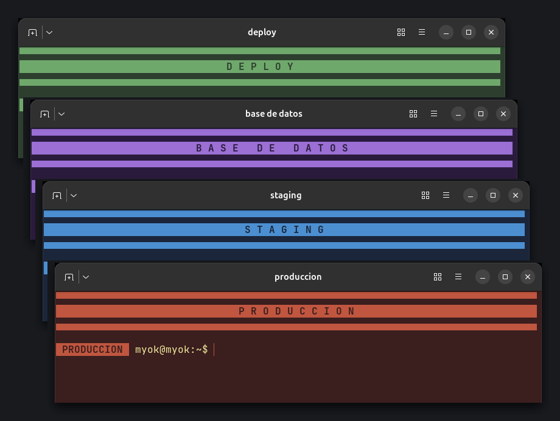
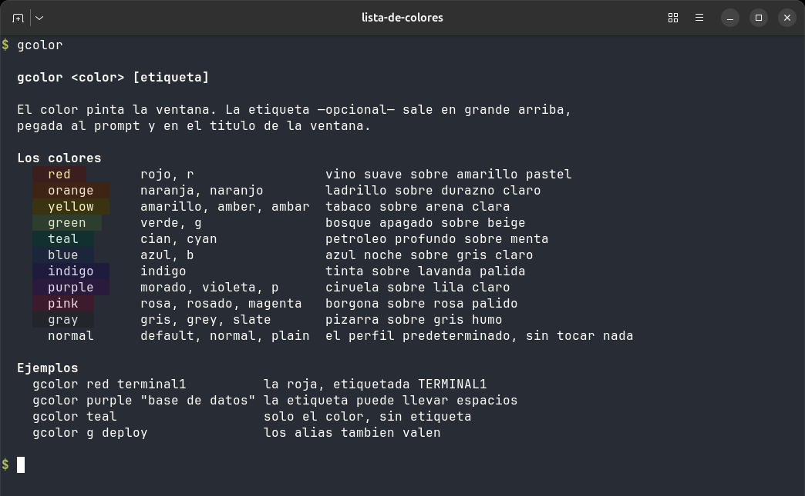
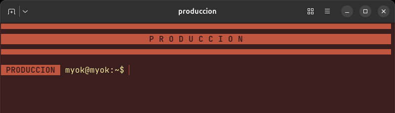

# Terminal Color Switcher

**Una terminal, un color, un nombre.** `gcolor red produccion` abre una ventana
nueva pintada de rojo y rotulada `PRODUCCION` en grande, arriba del todo.

Cuando tienes ocho terminales abiertas todas iguales, la que borra una base de
datos se parece demasiado a la que corre los tests. Este script le pone a cada
ventana un color de fondo y una etiqueta visible, para que sepas donde estas
antes de apretar Enter.



- **Sin configuracion.** El color y la etiqueta son argumentos, no perfiles que
  haya que crear y mantener.
- **No toca nada tuyo.** Tu `~/.bashrc` se carga igual que siempre, tu perfil
  predeterminado queda intacto y las ventanas ya abiertas no cambian.
- **Un solo archivo.** `gcolor` es bash puro, sin dependencias mas alla de la
  terminal que ya tienes.

Pensado para **Ghostty**. Si Ghostty no esta instalado, cae automaticamente a
GNOME Terminal.

# Instalacion

```
chmod +x install.sh
./install.sh
```

El instalador primero comprueba que **Ghostty** este instalado. Si no lo
encuentra, no instala nada y te dice como conseguirlo. Si esta, copia `gcolor`
a `/usr/local/bin` (pide `sudo` solo si hace falta).

Para instalarlo en otra ruta:

```
DESTINO=~/.local/bin ./install.sh
```

**Solo si usas GNOME Terminal** en vez de Ghostty, crea ademas los perfiles de
color:

```
chmod +x crear_perfiles.sh
./crear_perfiles.sh
```

Con Ghostty no hace falta este paso: los colores viajan como argumentos.

# Uso

```
gcolor <color> [etiqueta]
```

```
gcolor red terminal1        -> ventana roja, etiquetada TERMINAL1
gcolor purple "base de datos"  -> la etiqueta puede llevar espacios
gcolor teal                 -> solo el color, sin etiqueta
gcolor g deploy             -> los alias tambien valen
gcolor                      -> la lista de colores y como se usa
```

Cada terminal nueva tendra su color, sin modificar las otras ventanas abiertas.

# Los colores



| color | fondo | texto | alias | |
|---|---|---|---|---|
| `red` | `#3B1E1E` | `#F8E9A1` | rojo, r | vino suave sobre amarillo pastel |
| `orange` | `#3D2415` | `#F7E0CC` | naranja, naranjo | ladrillo sobre durazno claro |
| `yellow` | `#3A3312` | `#F5F0C0` | amarillo, amber, ambar | tabaco sobre arena clara |
| `green` | `#2D3E2F` | `#DCE4C5` | verde, g | bosque apagado sobre beige |
| `teal` | `#12302E` | `#CFEDE7` | cian, cyan | petroleo profundo sobre menta |
| `blue` | `#1B263B` | `#E0E1DD` | azul, b | azul noche sobre gris claro |
| `indigo` | `#1E1B3D` | `#DCD9F5` | indigo | tinta sobre lavanda palida |
| `purple` | `#2A1B3D` | `#E7DAF7` | morado, violeta, p | ciruela sobre lila claro |
| `pink` | `#3B1B2C` | `#F7D9E7` | rosa, rosado, magenta | borgona sobre rosa palido |
| `gray` | `#22262B` | `#D6DBE0` | gris, grey, slate | pizarra sobre gris humo |
| `normal` | | | default, plain | el perfil predeterminado, sin tocar nada |

Diez fondos oscuros, uno por familia de tono, para que dos ventanas nunca se
confundan. Cada uno lleva ademas un **acento** (cursor, seleccion y banda de la
etiqueta).

Para agregar un color propio basta con anadir una linea al array `TEMAS` del
script `gcolor`, con el formato `color:fondo:texto:acento:alias:descripcion`.

# La etiqueta

Si le pasas un nombre despues del color, la terminal se abre con:

- una **banda de color a todo el ancho** con el nombre en grande, arriba del todo;
- ese mismo nombre **pegado al prompt**, para que siga visible aunque hagas scroll;
- el **titulo de la ventana** puesto al nombre (util para el conmutador de ventanas).



```
▀▀▀▀▀▀▀▀▀▀▀▀▀▀▀▀▀▀▀▀▀▀▀▀▀▀▀▀▀▀▀▀▀▀▀▀▀▀▀▀▀▀▀
           T E R M I N A L 1
▄▄▄▄▄▄▄▄▄▄▄▄▄▄▄▄▄▄▄▄▄▄▄▄▄▄▄▄▄▄▄▄▄▄▄▄▄▄▄▄▄▄▄
```

Tu `~/.bashrc` se carga igual que siempre: la etiqueta se monta encima, no lo
reemplaza.

# Requisitos

- Ghostty (recomendado) **o** GNOME Terminal.
- Una terminal con color verdadero (24-bit) para que la banda se vea bien; tanto
  Ghostty como GNOME Terminal lo soportan.

# Notas

- `crear_perfiles.sh` no modifica tu perfil de terminal predeterminado.
- Es una solucion minimalista: no instala programas nuevos, usa solo herramientas
  del sistema.
- Ideal para trabajo profesional en ambientes donde se manejan multiples servidores
  o sesiones al mismo tiempo.
